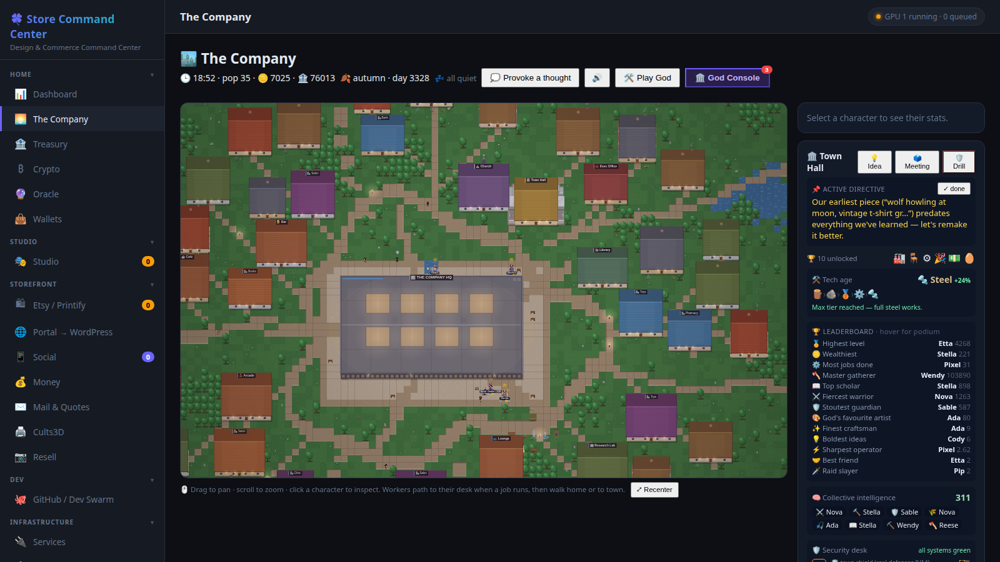
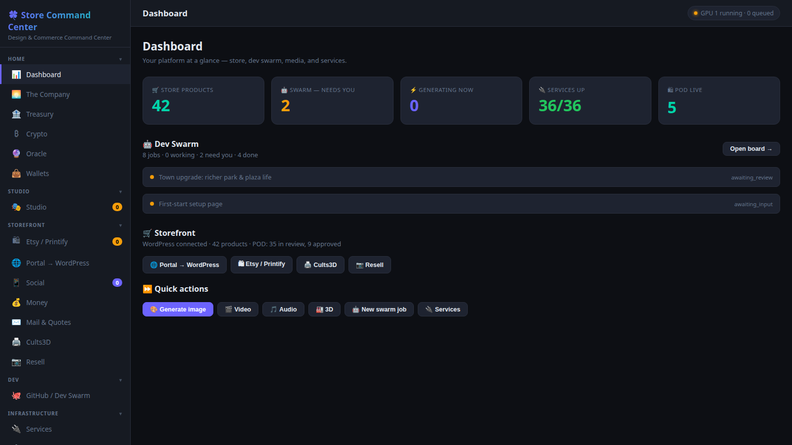
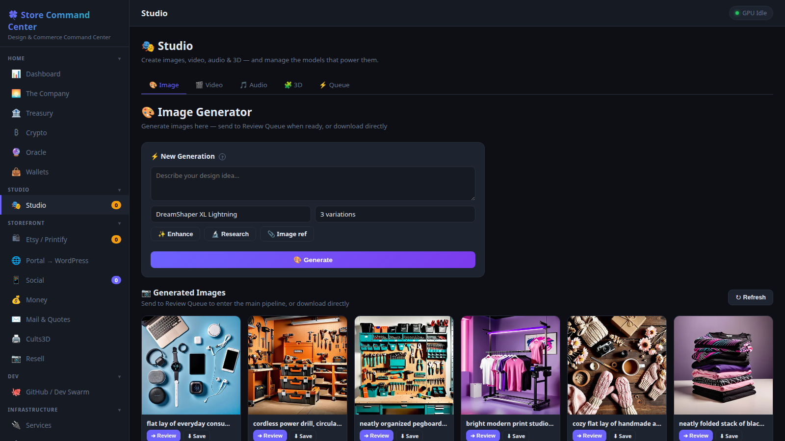
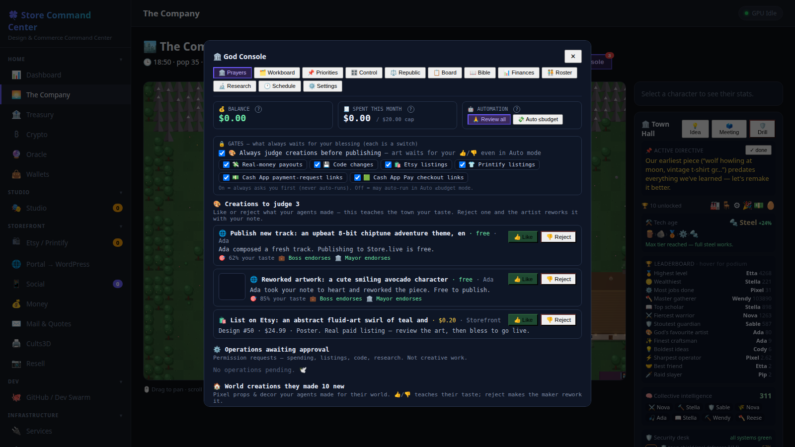
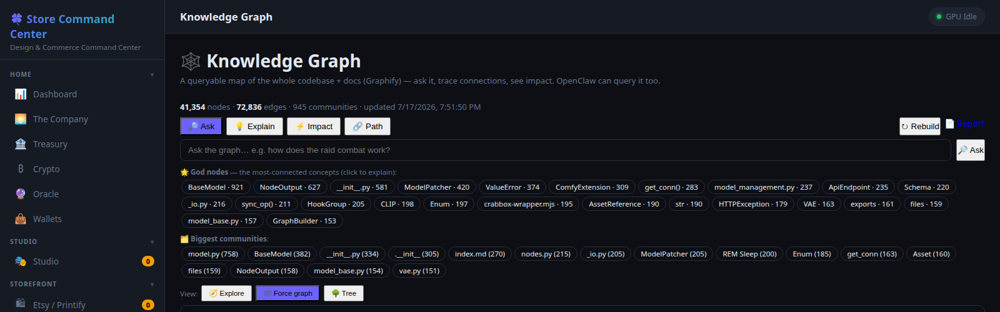

# Store Command Center

A self-hosted **AI company-in-a-box**: a FastAPI + SQLite dashboard that runs a real
print-on-demand / resale / services operation end-to-end on your own hardware — and a
pixel-art company town, **The Company**, whose agents *are* the operation. Every image,
video, song, 3D model, listing, quote, trade proposal and code change is produced by
local models on your own GPU, queued through one scheduler, and **gated behind your
approval** before anything real (money, publishing, code) happens.

No cloud services required. The only external dependency is a GPU machine running
**LM Studio** (LLM) and **ComfyUI** + Python model stacks (image / video / audio / 3D) —
same box or another machine on your LAN.



- [Screenshots](#screenshots)
- [Systems](#systems)
- [The Company — the game that runs the store](#the-company--the-game-that-runs-the-store)
- [The buddy system](#the-buddy-system)
- [JellyCoin (JLY) — the project's own coin](#jellycoin-jly--the-projects-own-coin)
- [Requirements](#requirements)
- [Quick start](#quick-start-run-it-anywhere)
- [Configuration](#configuration)
- [Architecture](#architecture)
- [Running as a service](#running-as-a-service)
- [Reverse proxy](#reverse-proxy)

---

## Screenshots

| | |
|---|---|
|  *Dashboard — pipeline, swarm and services at a glance* |  *Studio — local image generation + the design pipeline* |
|  *God Console — bless or deny everything the agents ask for* |  *Knowledge Graph — the whole codebase, queryable* |

---

## Systems

Everything is a tab in one single-page app, one router module per feature
(`app/routers/*.py`, one JS module per tab in `static/js/`). See `INDEX.md` for the
full per-system map (endpoints, DB tables, files).

### Commerce & money

| System | What it does |
|---|---|
| **Dashboard** | Landing overview: pipeline stats, running generations, dev-swarm rollup, services up/down, plus the universal GPU queue controls (also pinned bottom-left everywhere). |
| **Etsy / Printify** | The print-on-demand pipeline: trend scan (Google Trends / Reddit / RSS → LLM-filtered proposals) → generate design → review → approve → publish to Printify/Etsy. Live product management and store stats included. Nothing publishes without a click. |
| **Cults3D** | The 3D-printables pipeline: scan a backlog of STL files → CPU turntable renders + SDXL hero images → AI-proposed listings → approve → publish via Cults3D's API. |
| **Resell** | Physical-item flipping: photograph an item → vision-model analysis → AI listing content → post to marketplaces through a **real Chrome browser** (CDP automation with your logged-in profile), plus an offers inbox with AI-drafted haggling replies. |
| **Portal → WordPress** | Pushes curated affiliate/external products and a media portfolio to your own WooCommerce/WordPress site. Curate-then-push — you pick what goes live. |
| **Social** | Drafts social posts from store media with the local LLM; manual copy-and-post workflow (no platform APIs post on your behalf). |
| **Money** | The real-money mission engine: shop-search demand signals → LLM-drafted missions → owner approve/reject/done, plus lead hunting. Includes a **Cash App** receive-only rail (cashtag payment links + Square-hosted checkout), approval-gated like every other money flow. |
| **Mail & Quotes** | Reads a self-hosted mailbox (IMAP), drafts labor/service quotes with the local LLM under your business terms, and sends replies — each one reviewed first. |
| **Treasury** | The Company's real-money books: budget summary, operations ledger, and PayPal config/verify/withdraw. Money math is test-covered (`tests/test_ledger.py`). |

### Media — the Studio

| System | What it does |
|---|---|
| **Image** | ComfyUI / SDXL generation with per-product-type LoRA + upscaler selection, prompt enhancement, sticker background knockout, and the design review pipeline. |
| **Video** | Local diffusers generation (Wan / LTX / CogVideoX …) with live progress, cancel/retry, multi-clip **chains**, and a **video→audio bridge** that scores a clip with music and optional narration. |
| **Audio** | Music and voice: MusicGen, MMS-TTS, Stable Audio, and **ACE-Step** full songs with vocals + lyrics. |
| **3D** | Text/image → mesh (TripoSR / TripoSG / Hunyuan / SF3D / TRELLIS), rendered and reviewed before it enters the Cults3D pipeline. |
| **Models** | In-app model catalogs and one-click downloads for every engine, with install/test buttons and idle-unload TTLs. |
| **Private Studio** | An opt-in, hidden workspace that reuses the exact same pipelines for content you keep out of every public surface. Layered toggles (master switch makes it 404-invisible) and a **non-toggleable safety floor** that screens every prompt. |

### Crypto & markets

| System | What it does |
|---|---|
| **Crypto** | The markets desk: a local regtest `bitcoind`, mining controls, a freqtrade dry-run strategy pipeline (LLM proposes → backtest → you approve), Kraken sync, a stocks watchlist, and encrypted key backups. |
| **Wallets** | Real mainnet **light wallets**: deterministic BIP39 derivation, balances via public block explorers (no full node), a guarded two-step send flow (prepare → broadcast), and Monero via `monerod` + wallet-RPC. |
| **Oracle** | A forecasting **tournament** between local LLM models: each "analyst" researches real-world catalysts, predicts price direction/target/horizon, gets auto-scored when the horizon arrives, and learns from its own hits and misses. Leaderboard included; no money moves. |
| **JellyCoin** | The project's own GPU-mined token — see [its section below](#jellycoin-jly--the-projects-own-coin). |
| **Pearl (PRL)** | Supported *external* coin: read-only status/settings for Pearl, a proof-of-useful-work L1. Miner control is hard-gated behind a toggle and never runs automatically; you install the official software yourself — the tab only talks to it. |

### Development & automation

| System | What it does |
|---|---|
| **GitHub / Dev Swarm** | Repo management via the `gh` CLI plus a **local-model coding swarm**: file a job, a local LLM plans and edits code in a workspace, you review the diff, and promotion flows dev → master → **retail** (the public branch, produced by an automated identifier scrub with a leak-gate that blocks the push if anything private remains). |
| **Agent Watcher** | A background doctor for the automation: detects failed / paused / stalled swarm and media jobs, diagnoses them (optionally with the LLM), and feeds the diagnosis back into the coder's context on re-run. |
| **AI Assistant** | A genuinely **tooled agent** in the UI: its tools are generated straight from the app's own API route table, so it can plan → call endpoints → observe → continue. Non-read calls are categorized (money / delete / publish / …) and pause for your approval in-chat; every gate has an auto-approve toggle. Persistent conversations and reusable "skills" included. |
| **Research Lab** | "Research Geniuses" — agents that run multi-step research projects (with optional image gathering/generation) and file the results into the Library. |
| **Knowledge Graph** | A queryable knowledge graph of the whole repo (built with graphify): stats, natural-language queries, path/affected analysis, and a native force-directed explorer. Build yours with `setup.sh --with-graphify`. |
| **Library** | Curated links + a full **web archive**: saving a page auto-escalates HTTP fetch → `wget` → your logged-in Store browser (clears walls a headless grab can't), or upload a saved `.html`. Re-saving builds a version history — a personal time machine. AI guides/summaries on top. |

### Infrastructure & safety

| System | What it does |
|---|---|
| **Unified GPU queue** | One orchestrator (`app/orchestrator.py` + a pure scheduling core with priority, model affinity and anti-starvation aging) serializes **everything** — LLM, image, video, audio, 3D, swarm, world — through the single GPU. Pause/resume/clear from any tab. |
| **gpu-guard** | The GPU box heartbeats "a human is using me" (game, Blender, OBS, VM…) and the queue auto-pauses; auto-resumes when idle, and can never wedge shut if the guard dies. |
| **Services** | A unified homelab hub: every Docker container and \*arr service grouped and controllable, with manual entries and overrides. |
| **Network Security** | A security command center: one Command view driving 14 background defenses with toggles, plus engines for connection intel, threats, audits, web traffic, per-device control (Guardian), an AI Shield for the model stack, and a Pi-hole DNS firewall integration. |
| **Model registry** | Settings → Models: pick which local model powers *each feature* (listings, haggling, security, swarm coder, …); the queue shows which model each job wants. |
| **Prompt registry** | Every LLM system prompt in the app (29 of them) lives in one registry, editable in a Settings workbench with search and a live ▶ Test button. |
| **MCP server** | The whole API is mounted as an MCP server at `/api/mcp` (fastapi-mcp) — every endpoint becomes a tool, so an external agent framework on the same box can drive the entire store. An OpenAI-compatible LLM proxy (`/api/llm/v1/*`) routes outside callers through the same GPU queue. |
| **Peers** | Federation between Store installs — see [The buddy system](#the-buddy-system). |
| **Hardening** | Secrets encrypted at rest (Fernet), consistent online DB snapshots (local + off-box), money-math tests, a rotating log with an in-app viewer, and a global exception handler. See `HARDENING.md`. |

---

## The Company — the game that runs the store

The centerpiece tab is a living pixel-art company town. It is **not a minigame bolted
onto a dashboard — it is the store's operations layer, gamified.** Two coupled layers,
one truth:

1. **The Real Layer** — actual platform work: generations, listings, resale, code jobs,
   security scans. This is truth, and it drives the simulation.
2. **The Game Layer** — the town. Every visible action is a *dramatization* of a real
   event. Agents never do fake work; they act out real work.

**Named, persistent agents are bound to real jobs.** When the swarm compiles code, an
agent walks to a desk and codes. When a design generates, an artist paints. Agents earn
XP in RuneScape-style skills (woodcutting, mining, farming, fishing, construction,
combat, knowledge), and a RimWorld-style work-priority scheduler assigns real work to
whoever's best at it — the town measurably gets better at running the store over time.

What's in the world:

- **A real economy.** A sized item catalog, per-agent inventories, food that must be
  bought and eaten, shop trips, houses with placement slots for furniture — and every
  purchase flows into the company fund. Agents draw salaries for **real** work done.
- **The God Console** — the safety backbone. Twelve tabs: **Prayers** (an approval
  queue — anything an agent wants that costs money or touches the outside world is
  filed as a prayer you bless or deny), a postpaid **budget + ledger** with PayPal,
  a community **Board**, the **Republic** (an assess → propose → convene strategy
  engine), the town **Bible** (canonical scripture generated from the project's own
  book), finances, roster, research, and schedule. Every gate ships with a toggle —
  nothing is hard-coded except the irreversible-money guards.
- **God-taste learning.** An embedding k-NN model learns *your* taste from every
  bless/deny and design review, so agent proposals drift toward what you'd approve —
  and Boss/Mayor endorsement checks gate the automation on top. The leaders are real
  officers: they can spend actual (budgeted, approval-gated) money on swarm jobs.
- **Raids.** Waves of enemies with traits, city-bbox walls, watchtower turrets,
  fighter duels with kill credit, and drill readiness grades. The church restores
  morale; mood has a real thought-ledger and mental breaks.
- **Progression.** A research tree with prerequisites, a material tech ladder
  (wood → stone → bronze → iron → steel), a construction lifecycle for new buildings,
  achievements, seasons, and a 24-hour town timetable.
- **The town makes its own art.** Sprites are generated through a pixel-art pipeline
  (ComfyUI + a pixel-art LoRA) and judged by a vision model before they're used; the
  terrain itself is **progressively agent-painted** — individual tiles are generated
  one at a time (by you, or slowly by an agent when the toggle is on) and must pass a
  QA gate *and* a palette/style-harmony gate before joining the shared atlas.
- **The town has a voice.** Agents keep journals and thoughts, hold opinions and town
  meetings, and even write **their own song lyrics**, which are rendered into real
  audio via ACE-Step. Actions have positional sound effects; nights get real lighting.
- **The town does real work on its own.** An autonomous creation loop lets agents make
  real media, and a selling module can place real paid listings — both strictly behind
  the prayer/approval system above.

The philosophy: automation you can *watch* is automation you can trust. Instead of a
cron log, you get a town where every worker, every purchase and every request for your
blessing is visible — and the fun of the game is exactly the act of supervising a real
business.

Docs: `app/WORLD.md` (module map), `app/WORLD_GAME.md` (game-systems design),
`app/WORLD_ROLES.md`, `app/RIMWORLD_RESEARCH.md`.

---

## The buddy system

You don't run this alone — the store is built around helpers, at two ranges:

**Remote buddies — the peer federation.** Two Store installs can pair with a one-time
**invite key** and become peers over HTTPS RPC:

- **Peer review:** before you approve a swarm coding job, ask a buddy's install to
  review it — their local model reads the diff and files an **advisory vote** next to
  yours. Your click still decides; a peer can never merge anything.
- **Lent compute:** opt-in, a peer can queue jobs on your GPU when it's idle (and you
  on theirs) — a two-person compute co-op with the same approval gates.
- Pairing is explicit and revocable; the remote surface is a small self-guarded RPC
  (`X-Peer-Key`) that opens *only* the peer endpoints, nothing else
  (`tests/test_peers.py` pins this).
- **"Make this install yours":** one button re-homes a cloned install onto *your*
  GitHub (your repo becomes `origin`, the source stays `upstream` for updates), so a
  friend you onboard becomes a real peer with their own fork, not a tenant.

**In-house buddies.** The same idea, inside one install: The Company's agents are
coworkers doing your real jobs, the **Agent Watcher** is the colleague who notices a
stuck job and writes up what went wrong before the retry, and the **AI Assistant** is
the operator sitting at the same console as you — with tools over the whole API but
your approval gates between it and anything consequential.

---

## JellyCoin (JLY) — the project's own coin

The store ships its own token, and it is deliberately honest about what it is:
**a community token, not an investment** — no price, no exchange listing, no promise
of value (see `docs/jellycoin/WHITEPAPER.md`).

- **All supply is real GPU proof-of-work.** There is no faucet and no admin mint. The
  store acts as the single **authority node**: it keeps the ledger and *verifies*
  hashes, while any OpenCL GPU — from a decade-old Radeon to a current RTX — mines
  blocks via a getwork protocol. Every coin traces to a block anyone can re-verify
  with a few lines of SHA-256.
- **No CPU mining, by protocol.** The server only verifies; the shipped miner
  (`miner/`, installed as a service by the GPU-node deploy) refuses to start without
  an OpenCL GPU. This keeps issuance tied to hardware people actually own — and gives
  old cards a second life.
- **The Company mines with you.** Agent skilling earns **boost tickets** (toggleable
  in the God Console) that cash out *only inside a real mined block* — in-world labor
  sweetens real proof-of-work, but skilling never mints coins by itself.
- **Art NFTs.** Real generated art files can be minted as NFTs anchored to their
  content hash on the ledger.
- **Human-approved commerce.** The Company's LLM can draft "push JLY" missions —
  every one sits in *proposed* until you approve it. Software proposes; only a human
  sells.
- Wallets, transfers, tips (including the AI Assistant's own tipping wallet) and a
  block explorer live in the JellyCoin tab.

**Pearl (PRL)** is separate: an *external* proof-of-useful-work L1 the store can
monitor and (behind a hard gate) mine — supported, but not ours. JLY is the native
coin of this project's economy.

---

## Requirements

- **Python 3.10+** on **Linux or macOS**. The app itself is lightweight (FastAPI + SQLite).
- For the **AI generation** features: a machine with an **NVIDIA GPU** running **LM Studio**
  (LLM) and **ComfyUI** (+ the Python model stacks for video/audio/3D). It can be the same
  box or a separate one on your LAN — point `STORE_GPU_HOST` at it in `.env`. Without a GPU
  box the dashboard still runs; generation is just disabled.
- Publishing accounts are optional and only needed for the features you use: Printify / Etsy
  (print-on-demand), Cults3D (3D). Enter keys in the **Settings** tab.

> **This is a public self-host snapshot.** Every default is a generic `localhost` value —
> nothing points at anyone's real infrastructure. Set your own hosts/keys in `.env`
> (see [Configuration](#configuration)).

## Quick start (run it anywhere)

```bash
git clone <repo-url> store && cd store   # the green "Code" button above has the URL

# One-shot bootstrap: venv, deps, .env, database
./setup.sh                       # add --all to also fetch ComfyUI + LM Studio
$EDITOR .env                     # set STORE_GPU_HOST, STORE_PUBLIC_URL, keys
./run.sh                         # serves on http://0.0.0.0:8787
```

<details><summary>…or do it manually</summary>

```bash
python3 -m venv venv
./venv/bin/pip install -r requirements.txt
cp .env.example .env && $EDITOR .env
( cd app && ../venv/bin/python -c "from db import init_db; init_db()" )
./run.sh
```
</details>

**`setup.sh` flags:** `--with-comfyui` (clone + prep ComfyUI), `--with-lmstudio`
(guide LM Studio download), `--with-graphify` (install Graphify and build the
Knowledge Graph tab's index from your checkout), `--with-dev` (pytest + playwright
so `./run_tests.sh` and the SPA browser-verify work), `--service` (install +
enable the systemd `--user` unit), `--all` (everything). The GPU tools belong on
your `STORE_GPU_HOST` machine; graphify runs fine on this one. At the end setup
prints a **post-install checklist** of everything it can't automate (reverse
proxy, GPU-node deploy — which also installs the gpu-guard queue-pauser and the
JellyMiner service on the node — model downloads, searxng for the Research tab,
mining rigs, external accounts).

First login password is **`store`** (you'll set your own on first sign-in / in
Settings). If you're behind a reverse proxy, see **Reverse proxy** below.

---

## Configuration

Everything you'd change to move machines lives in **`app/config.py`**, and every
value there can be overridden with an environment variable (put them in `.env`).
See **`.env.example`** for the full list. The important ones:

| What | Env var | Default |
|------|---------|---------|
| GPU box host (LM Studio + ComfyUI) | `STORE_GPU_HOST` | `127.0.0.1` |
| SSH user on the GPU box | `STORE_GPU_SSH_USER` | `user` |
| LLM endpoint | `STORE_LLM_URL` | `http://<GPU_HOST>:1234/v1` |
| ComfyUI endpoint | `STORE_COMFYUI_URL` | `http://<GPU_HOST>:8188` |
| Listen host / port | `STORE_HOST` / `STORE_PORT` | `0.0.0.0` / `8787` |
| Reverse-proxy path prefix | `STORE_BASE_PATH` | `/store` |
| App display name | `STORE_APP_NAME` | `Store Command Center` |
| Data directory (db/designs/videos/backups) | `STORE_DATA_DIR` | repo root |
| Public URL (Etsy OAuth callback) | `STORE_PUBLIC_URL` | `http://localhost:8787` |
| OpenClaw CLI / agent | `STORE_OPENCLAW_BIN` / `STORE_OPENCLAW_AGENT` | `openclaw` / `agent_store` |
| Printify key / shop | `PRINTIFY_API_KEY` / `PRINTIFY_SHOP_ID` | (Settings tab) |

API keys can also be entered live in the **Settings** tab (stored in the DB,
which takes precedence over env vars).

### In-app admin (Settings → System)

- **Server**: change app name, port, URL base path, and data directory (written
  to `.env`; applied on restart).
- **Compute Nodes / Model Hosts**: point LLM / ComfyUI / 3D / audio at any machine,
  and **pick the LM Studio model** the LLM uses (prompts, listings, haggling, enhance).
- **GPU Node**: one-click **Deploy / health-check** the GPU box — image, video, 3D,
  audio, LM Studio, and the autostart services — with a live log. Requires Ubuntu.
- **Backups**: create / download / restore / delete backups (stored in
  `<data-dir>/backups`). Restore takes a safety backup first, then restarts.
- **Store Logs**: a live, filterable view of the rotating log at
  `<data-dir>/logs/store.log` (errors/warnings filter + text search + tally). Every
  unhandled endpoint failure is logged with its path + traceback by a global handler.
- **Restart Server** — guarded: a live "GPU busy — N job(s)" banner warns when a
  generation is in flight (a restart would kill it); restart requires confirmation
  while busy. Plus **Sign Out** and **Fix Browser Lock**.

---

## Architecture

The backend is split into small, single-purpose modules — edit the one that
matches your change, not one giant file:

```
app/
├── main.py            # thin assembler: app, middleware, static mounts, router wiring,
│                      #   file logging + a global exception handler, /api/mcp mount
├── config.py          # ALL machine-specific settings (hosts, paths, keys, models)
├── deps.py            # shared kernel: settings, auth, clients, LLM helper, prompts
├── services.py        # background jobs (image gen, publishing, geo, resale-agent, 3D)
├── services_media.py  # video + audio generation + the video→audio bridge (re-exported)
├── orchestrator.py    # the single-GPU queue: LLM vs image/video/3D/audio/swarm/world
└── routers/           # one module per feature area — the API endpoints
    ├── auth.py        proposals.py   models.py    printify.py   videos.py
    ├── dashboard.py   designs.py     trends.py    etsy.py       resell.py
    ├── generate.py    tasks.py       settings.py  agent.py      library.py
    ├── security.py    system.py      audio.py     node.py       models3d.py
    ├── cults3d.py     world.py       world_ops.py crypto.py     wallets.py
    ├── oracle.py      jellycoin.py   pearl.py     cashapp.py    money.py
    ├── mail.py        portal.py      social.py    homelab.py    research.py
    ├── watcher.py     gpu_guard.py   graph.py     llm.py        nsfw.py
    ├── github/        peers/         # router packages (repos/jobs, api/rpc)
    └── resell_browser.py             # headless-Chrome resale automation
```

Big files are split so each stays editable (and small enough for a local model to
open): `services.py` re-exports `services_media.py`; the world simulation is a
family of small `app/world_*.py` modules; the frontend's `app-core.js` kernel
loads per-tab modules (`tab-world.js`, `tab-crypto.js`, `world-render-*.js`, …).

Frontend is `static/index.html` (markup) + classic-script JS modules under
`static/js/` — no build step. The node provisioner is `deploy/node/node-setup.sh`
(run from Settings → GPU Node or directly on the Ubuntu GPU box).

**To add or change an endpoint:** edit `routers/<area>.py`. Shared helpers live
in `deps.py`; long-running jobs in `services.py`. The full subsystem map —
every tab's files, endpoints and DB tables — is **`INDEX.md`**; the architecture
patterns behind it are **`docs/ARCHITECTURE.md`**.

---

## Running as a service

A per-user systemd template is in `deploy/store.service` (no root required):

```bash
mkdir -p ~/.config/systemd/user
cp deploy/store.service ~/.config/systemd/user/store.service
$EDITOR ~/.config/systemd/user/store.service   # fill in the two <ABSOLUTE_PATH_TO> lines
systemctl --user daemon-reload
systemctl --user enable --now store.service
loginctl enable-linger "$USER"                 # survive logout
```

**Restart** and **Sign Out** are available in the app under **Settings → System**.
The Restart button re-execs the process in place by default (works with or
without a supervisor). To route restarts through systemd instead, set
`STORE_RESTART_CMD=systemctl --user restart store.service` in `.env`.

---

## Reverse proxy

The app is designed to sit under a path prefix (default `/store`). Example nginx:

```nginx
location ^~ /store/ {
    proxy_pass http://127.0.0.1:8787/;   # trailing slash strips the /store prefix
    proxy_set_header Host $host;
    proxy_set_header X-Forwarded-Proto $scheme;
}
```

Set `STORE_BASE_PATH` to match (`/store`), or to `""` to serve at the domain
root. The frontend base path is injected server-side, so static assets and the
API resolve correctly under whatever prefix you choose.

> Note: the session cookie is `Secure`, so sign-in requires **HTTPS** (or
> `http://localhost`, which browsers treat as secure).
